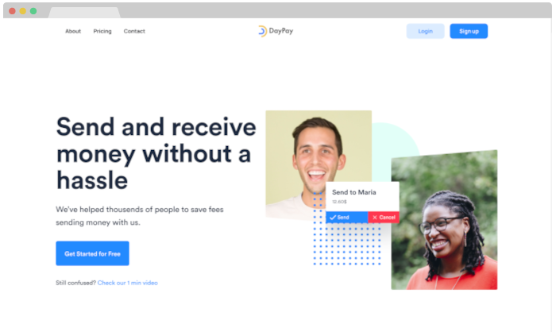

<!--
*** Thanks for checking out the Best-README-Template. If you have a suggestion
*** that would make this better, please fork the repo and create a pull request
*** or simply open an issue with the tag "enhancement".
*** Thanks again! Now go create something AMAZING! : D
***
***
***
*** To avoid retyping too much info. Do a search and replace for the following:
*** raulsalcedo03, DayPay-react, twitter_handle, email, DayPay, project_description
-->

<!-- PROJECT SHIELDS -->
<!--
*** I'm using markdown "reference style" links for readability.
*** Reference links are enclosed in brackets [ ] instead of parentheses ( ).
*** See the bottom of this document for the declaration of the reference variables
*** for contributors-url, forks-url, etc. This is an optional, concise syntax you may use.
*** https://www.markdownguide.org/basic-syntax/#reference-style-links
-->
<!-- PROJECT LOGO -->
<br />
<p align="center">
  <a href="https://github.com/raulsalcedo03/DayPay-react" />
  

  <h3 align="center">DayPay</h3>

  <p align="center">
    <br />
    <a href="https://github.com/raulsalcedo03/DayPay-react"><strong>Explore the docs »</strong></a>
    <br />
    <br />
    <a href="https://github.com/raulsalcedo03/DayPay-react">View Demo</a>
    ·
    <a href="https://github.com/raulsalcedo03/DayPay-react/issues">Report Bug</a>
    ·
    <a href="https://github.com/raulsalcedo03/DayPay-react/issues">Request Feature</a>

  </p>
</p>

<!-- TABLE OF CONTENTS -->
<details open="open">
  <summary><h2 style="display: inline-block">Table of Contents</h2></summary>
  <ol>
    <li>
      <a href="#about-the-project">About The Project</a>
      <ul>
        <li><a href="#built-with">Built With</a></li>
      </ul>
    </li>
    <li>
      <a href="#getting-started">Getting Started</a>
      <ul>
        <li><a href="#prerequisites">Prerequisites</a></li>
        <li><a href="#installation">Installation</a></li>
      </ul>
    </li>
    <li><a href="#working-conventions">Working conventions</a></li>
    <li><a href="#roadmap">Roadmap</a></li>
    <li><a href="#license">License</a></li>
    <li><a href="#acknowledgements">Acknowledgements</a></li>

  </ol>
</details>

<!-- ABOUT THE PROJECT -->

## About The Project

<p align="center">
  
</p>

### Built With

- [React](https://reactjs.org/)
- [Express](https://expressjs.com/)

<!-- GETTING STARTED -->

## Getting Started

To get a local copy up and running follow these simple steps.

### Prerequisites

- npm

```sh
  npm install npm@latest -g
```

- docker

```sh
https://docs.docker.com/engine/install/ubuntu/
```

### Installation

1. Clone the repo

```sh
   git clone https://github.com/raulsalcedo03/DayPay-react.git
```

2. Install NPM packages

```sh
   npm install
```

3. Clone the backend repo

```sh
   git clone https://github.com/raulsalcedo03/DayPay-node.git
```

4. Install backend NPM packages

```sh
   npm install
```

5. Setup MongoDB image using docker:

```sh
   sudo docker run -d -p 127.0.0.1:27017:27017 --name DayPay-node \
    -e MONGO_INITDB_ROOT_USERNAME=mongoadmin \
    -e MONGO_INITDB_ROOT_PASSWORD=secret \
    mongo
```

6. Run the mongo image in docker:

```sh
sudo docker start DayPay-node
```

7. Start the backend server:

```sh
npm start
```

8. Start the frontend server:

```sh
npm start
```

<!-- USAGE EXAMPLES -->

<!-- ## Usage -->

<!-- WORK CONVENTIONS -->

## Working Conventions

We will use camelCase for all naming conventions.
</br>
When creating class names, if the class is a container we will name it according to what will be contained followed by \_\_container. eg:

```sh
<div className="trustBox__container">trustBox</div>
```

Branches will be named after the developer and the feature being developed. eg:

```sh
raulSalcedo-user-API
```

Pull request have to be reviewed by two team members before merging and have to be tested berfore commiting the changes.

</br>
</br>
</br>

Usamos camelCase para todos los nombres.
</br>
Al crear cajas contenedoras para añadiremos \_\_container al final del nombre de la siguiente manera:

```sh
<div className="trustBox__container">trustBox</div>
```

Nombraremos las ramas en funcion de quien essta trabajando en ella y de la feature a trabajar. Por ejemplo:

```sh
raulSalcedo-user-API
```

Las pull request tienen que ser revisadas por lo menos por dos miembros del equipo.

<!-- ROADMAP -->

## Roadmap

See the [open issues](https://github.com/raulsalcedo03/DayPay-react/issues) for a list of proposed features (and known issues).

<!-- CONTRIBUTING -->

<!-- LICENSE -->

<!-- CONTACT -->

## Contact

Raul Salcedo - raul.salcedo03@hotmail.com
</br>
Marcos Andaluz de Rosas - mandaluzr@hotmail.com
</br>
Felipe Meira - f.zende@gmail.com
</br>
Richard Perdomo - richard.perdomo121@gmail.com
</br>
Adrià Santos - adria@santos.cat
</br>
Alejo Viñeta - avinetam@gmail.com

Project Link: [https://github.com/raulsalcedo03/DayPay-react](https://github.com/raulsalcedo03/DayPay-react)

<!-- ACKNOWLEDGEMENTS -->

## Acknowledgements

- [Readme template](https://github.com/othneildrew/Best-README-Template)

<!-- MARKDOWN LINKS & IMAGES -->
<!-- https://www.markdownguide.org/basic-syntax/#reference-style-links -->

[contributors-shield]: https://img.shields.io/github/contributors/raulsalcedo03/repo.svg?style=for-the-badge
[contributors-url]: https://github.com/raulsalcedo03/repo/graphs/contributors
[forks-shield]: https://img.shields.io/github/forks/raulsalcedo03/repo.svg?style=for-the-badge
[forks-url]: https://github.com/raulsalcedo03/repo/network/members
[stars-shield]: https://img.shields.io/github/stars/raulsalcedo03/repo.svg?style=for-the-badge
[stars-url]: https://github.com/raulsalcedo03/repo/stargazers
[issues-shield]: https://img.shields.io/github/issues/raulsalcedo03/repo.svg?style=for-the-badge
[issues-url]: https://github.com/raulsalcedo03/repo/issues
[license-shield]: https://img.shields.io/github/license/raulsalcedo03/repo.svg?style=for-the-badge
[license-url]: https://github.com/raulsalcedo03/repo/blob/master/LICENSE.txt
[linkedin-shield]: https://img.shields.io/badge/-LinkedIn-black.svg?style=for-the-badge&logo=linkedin&colorB=555
[linkedin-url]: https://linkedin.com/in/raulsalcedo03
